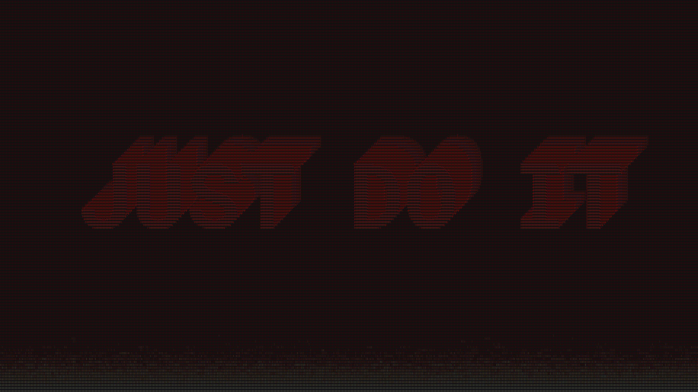
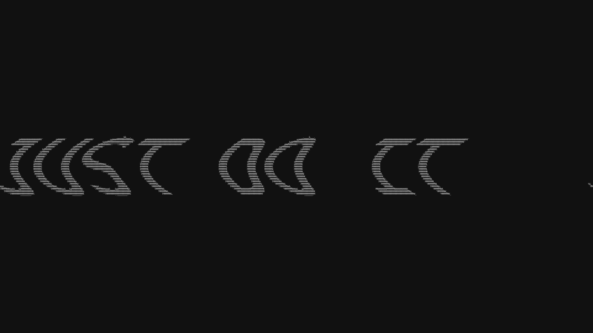
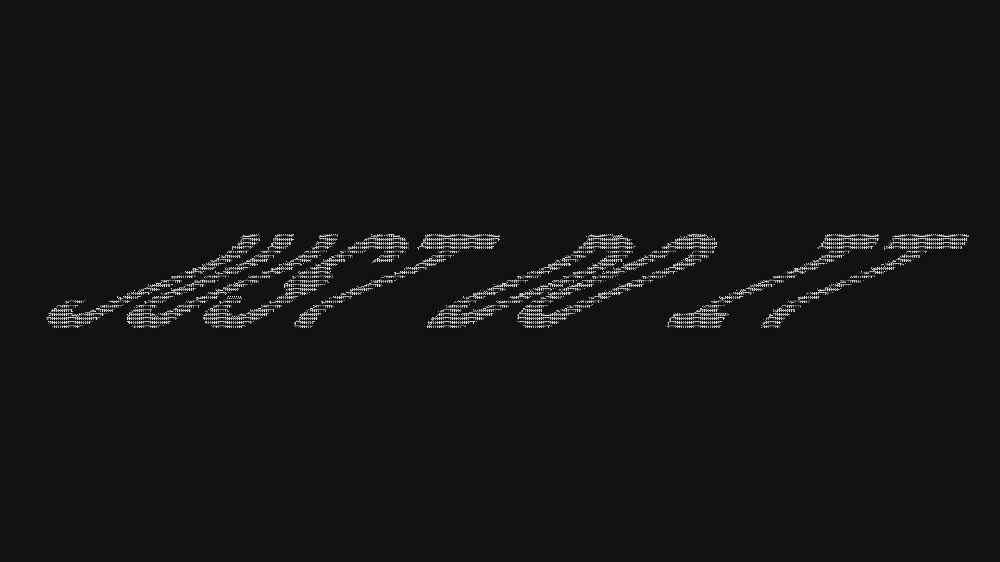
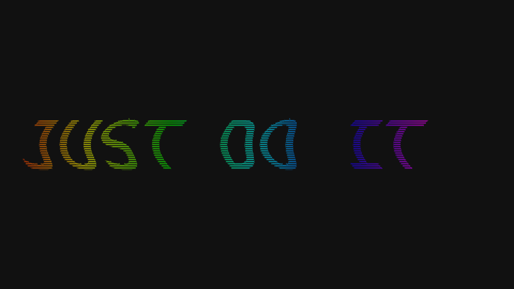
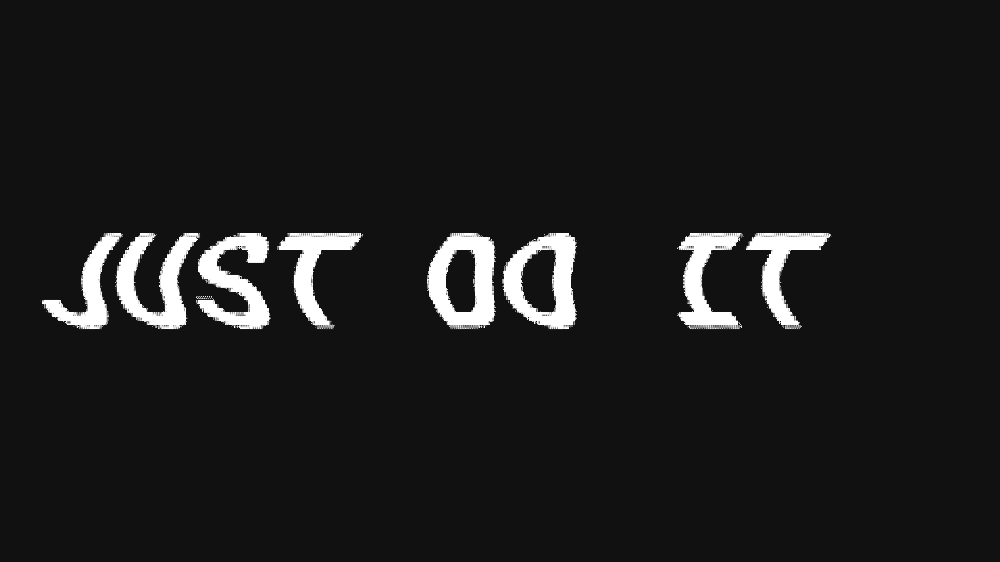

# 4K Gallery (PNG)

> 3840×2160 true-pixel renders — 480×135 char grid, 8×16px cells.
> Each PNG is a full 4K frame. Download and view at 100% for full detail.

- [Fonts](#fonts)

## Fonts

<table>
<tr>
<td align="center"> <b>G09 — Attractor</b></td>
<td align="center"> <b>G09 — Cells</b></td>
</tr>
<tr>
<td align="center"> <b>G09 — Clean Cyan</b></td>
<td align="center"> <b>G09 — Clean Rainbow</b></td>
</tr>
<tr>
<td align="center"> <b>G09 — Clean White</b></td>
<td align="center"> <b>G09 — Density Fire</b></td>
</tr>
<tr>
<td align="center"> <b>G09 — Density</b></td>
<td align="center"> <b>G09 — Flame Cool</b></td>
</tr>
<tr>
<td align="center"> <b>G09 — Flame Embers</b></td>
<td align="center"> <b>G09 — Flame Hot</b></td>
</tr>
<tr>
<td align="center"> <b>G09 — Flame Lava</b></td>
<td align="center"> <b>G09 — Flame</b></td>
</tr>
<tr>
<td align="center"> <b>G09 — Fractal Julia</b></td>
<td align="center"> <b>G09 — Fractal</b></td>
</tr>
<tr>
<td align="center"> <b>G09 — Gradient Diag</b></td>
<td align="center"> <b>G09 — Gradient Horiz</b></td>
</tr>
<tr>
<td align="center"> <b>G09 — Gradient Radial</b></td>
<td align="center"> <b>G09 — Gradient Vert</b></td>
</tr>
<tr>
<td align="center"> <b>G09 — Iso Flame</b></td>
<td align="center"> <b>G09 — Iso Left</b></td>
</tr>
<tr>
<td align="center"> <b>G09 — Iso Right</b></td>
<td align="center"> <b>G09 — Lsystem</b></td>
</tr>
<tr>
<td align="center"> <b>G09 — Noise Radial</b></td>
<td align="center"> <b>G09 — Noise</b></td>
</tr>
<tr>
<td align="center"> <b>G09 — Palette Bio</b></td>
<td align="center"> <b>G09 — Palette Escape</b></td>
</tr>
<tr>
<td align="center"> <b>G09 — Palette Fire</b></td>
<td align="center"> <b>G09 — Palette Lava</b></td>
</tr>
<tr>
<td align="center"> <b>G09 — Perspective Bottom</b></td>
<td align="center"> <b>G09 — Perspective Top</b></td>
</tr>
<tr>
<td align="center"> <b>G09 — Plasma Diagonal</b></td>
<td align="center"> <b>G09 — Plasma Slow</b></td>
</tr>
<tr>
<td align="center"> <b>G09 — Plasma Tight</b></td>
<td align="center"> <b>G09 — Plasma</b></td>
</tr>
<tr>
<td align="center"> <b>G09 — Sdf Mid</b></td>
<td align="center"> <b>G09 — Sdf Neon</b></td>
</tr>
<tr>
<td align="center"> <b>G09 — Sdf Outline</b></td>
<td align="center"> <b>G09 — Sdf</b></td>
</tr>
<tr>
<td align="center"> <b>G09 — Shape Ocean</b></td>
<td align="center"> <b>G09 — Shape</b></td>
</tr>
<tr>
<td align="center"> <b>G09 — Shear Left</b></td>
<td align="center"> <b>G09 — Shear Plasma</b></td>
</tr>
<tr>
<td align="center"> <b>G09 — Shear Right</b></td>
<td align="center"> <b>G09 — Sine Warp Deep</b></td>
</tr>
<tr>
<td align="center"> <b>G09 — Sine Warp Fast</b></td>
<td align="center"> <b>G09 — Sine Warp Rainbow</b></td>
</tr>
<tr>
<td align="center"> <b>G09 — Sine Warp</b></td>
<td align="center"> <b>G09 — Slime</b></td>
</tr>
<tr>
<td align="center"> <b>G09 — Truchet</b></td>
<td align="center"> <b>G09 — Turing Maze</b></td>
</tr>
<tr>
<td align="center"> <b>G09 — Turing Spots</b></td>
<td align="center"> <b>G09 — Turing</b></td>
</tr>
<tr>
<td align="center"> <b>G09 — Voronoi Cells</b></td>
<td align="center"> <b>G09 — Voronoi Coarse</b></td>
</tr>
<tr>
<td align="center"> <b>G09 — Voronoi Cracked</b></td>
<td align="center"> <b>G09 — Voronoi Fine</b></td>
</tr>
<tr>
<td align="center"> <b>G09 — Voronoi</b></td>
<td align="center"> <b>G09 — Wave Moire</b></td>
</tr>
<tr>
<td align="center"> <b>G09 — Wave</b></td>
</tr>
</table>