# JustDoIt Gallery

Auto-generated visual showcase of rendering techniques.
Run `python scripts/demo.py --gallery` to regenerate.

> **4K gallery** — SVGs rendered via G09 image pipeline (PIL TTF raster → 6D zone-match ASCII → SVG). Full 480×67 character grid at 3840×1080px. Open any SVG directly for native 4K density.

## Contents

- [Fonts (46)](#fonts)

## Fonts

*Builtin, FIGlet, and TTF rasterized fonts*

<table>
<tr>
<td align="center"> <b>G09 — Attractor</b></td>
<td align="center"> <b>G09 — Cells</b></td>
</tr>
<tr>
<td align="center"> <b>G09 — Clean Cyan</b></td>
<td align="center"> <b>G09 — Clean Rainbow</b></td>
</tr>
<tr>
<td align="center"> <b>G09 — Clean White</b></td>
<td align="center">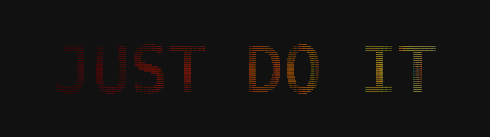 <b>G09 — Density Fire</b></td>
</tr>
<tr>
<td align="center">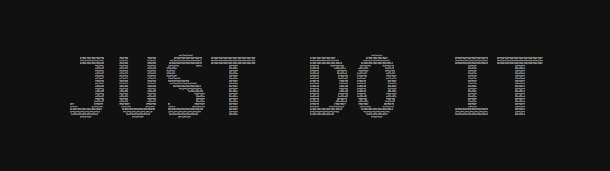 <b>G09 — Density</b></td>
<td align="center">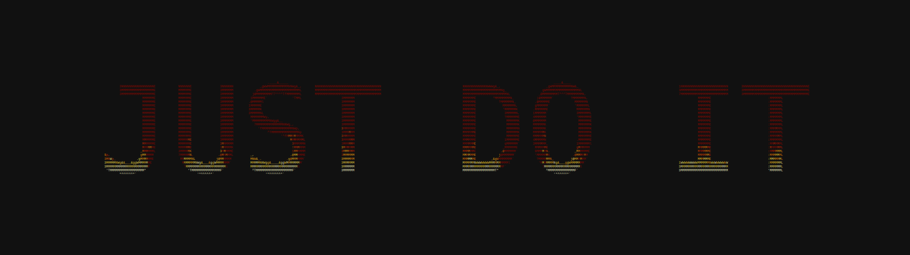 <b>G09 — Flame Cool</b></td>
</tr>
<tr>
<td align="center">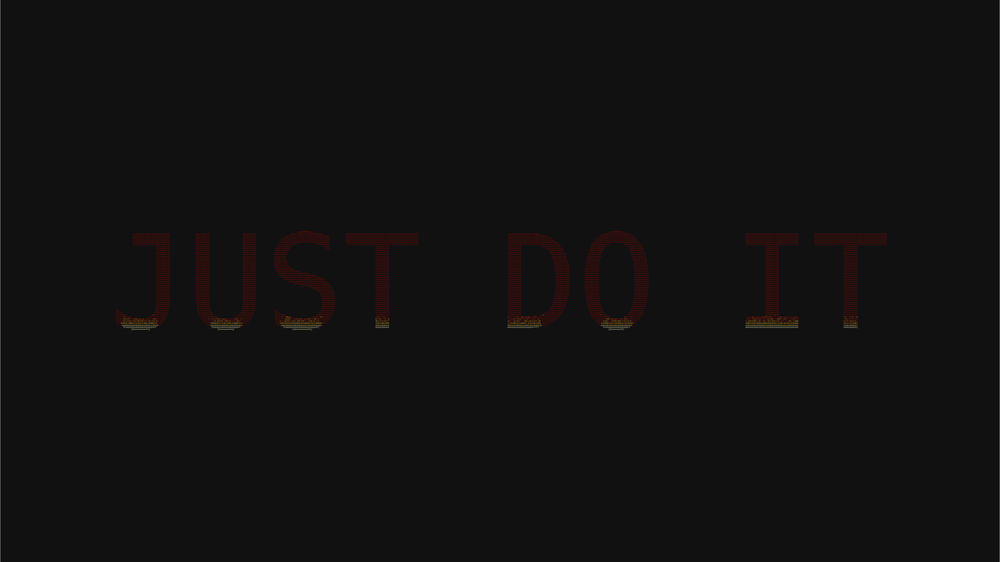 <b>G09 — Flame Embers</b></td>
<td align="center">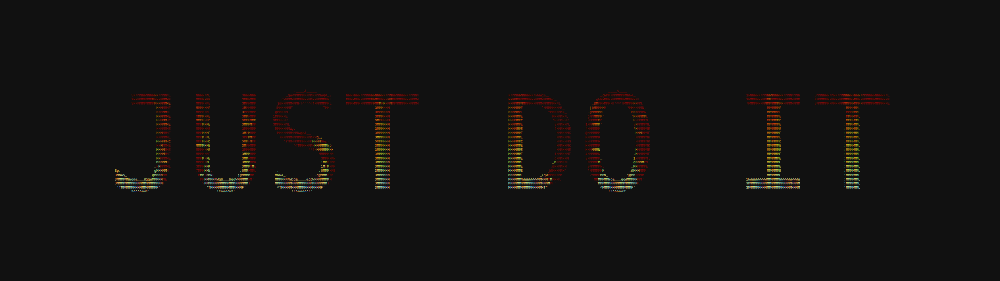 <b>G09 — Flame Hot</b></td>
</tr>
<tr>
<td align="center"> <b>G09 — Flame Lava</b></td>
<td align="center">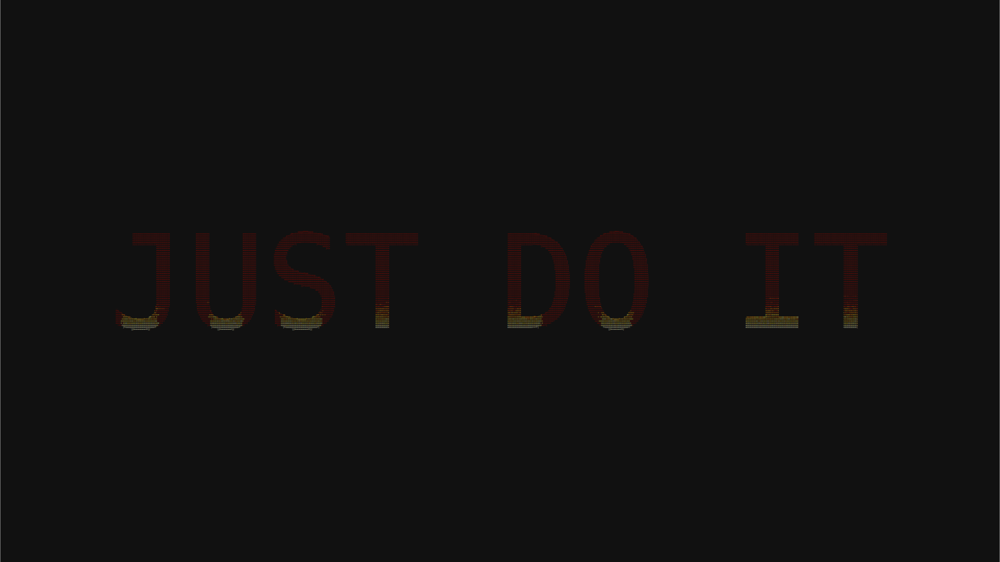 <b>G09 — Flame</b></td>
</tr>
<tr>
<td align="center">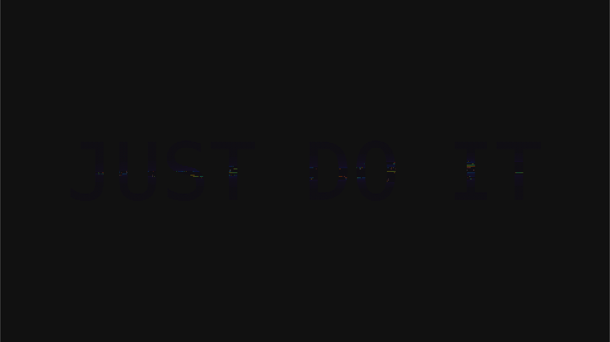 <b>G09 — Fractal Julia</b></td>
<td align="center">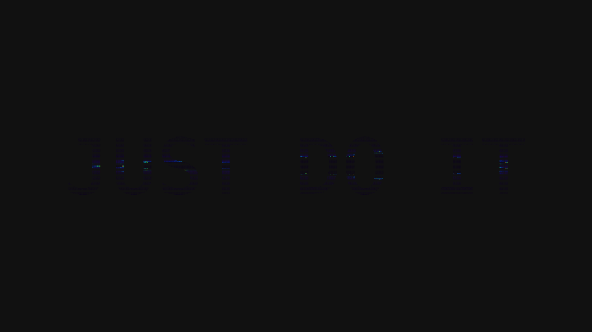 <b>G09 — Fractal</b></td>
</tr>
<tr>
<td align="center">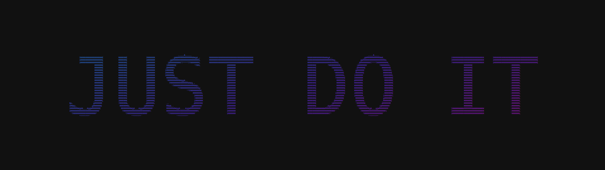 <b>G09 — Gradient Diag</b></td>
<td align="center"> <b>G09 — Gradient Horiz</b></td>
</tr>
<tr>
<td align="center">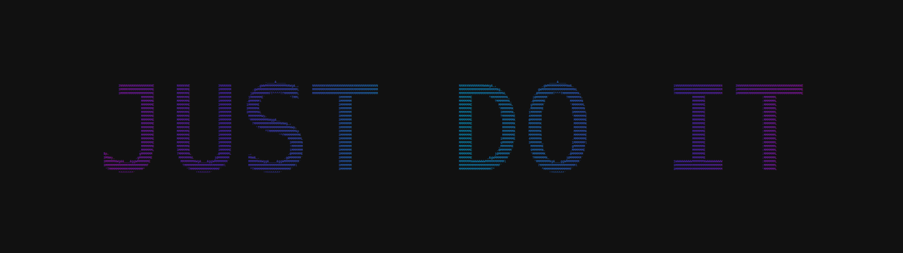 <b>G09 — Gradient Radial</b></td>
<td align="center">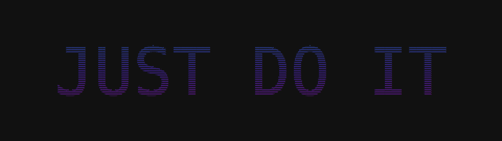 <b>G09 — Gradient Vert</b></td>
</tr>
<tr>
<td align="center">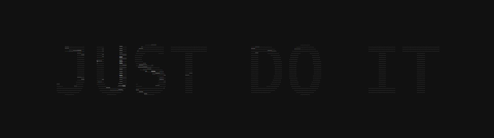 <b>G09 — Lsystem</b></td>
<td align="center">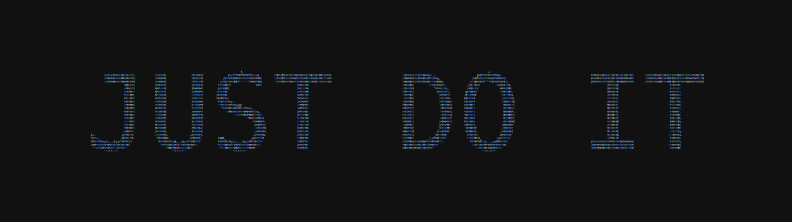 <b>G09 — Noise Radial</b></td>
</tr>
<tr>
<td align="center"> <b>G09 — Noise</b></td>
<td align="center">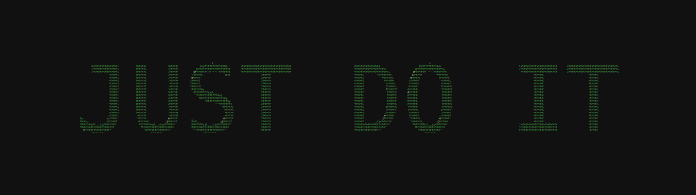 <b>G09 — Palette Bio</b></td>
</tr>
<tr>
<td align="center"> <b>G09 — Palette Escape</b></td>
<td align="center">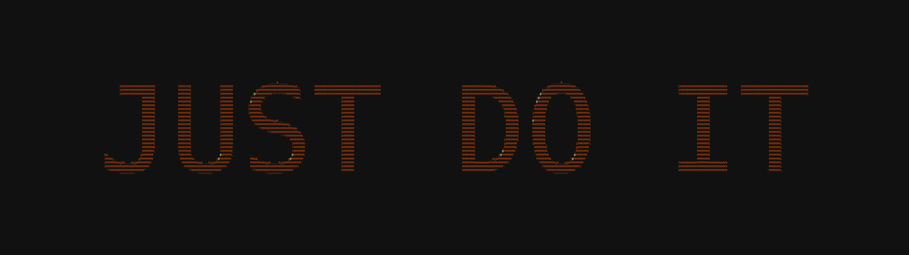 <b>G09 — Palette Fire</b></td>
</tr>
<tr>
<td align="center"> <b>G09 — Palette Lava</b></td>
<td align="center"> <b>G09 — Plasma Diagonal</b></td>
</tr>
<tr>
<td align="center">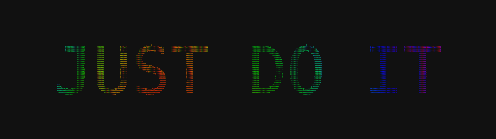 <b>G09 — Plasma Slow</b></td>
<td align="center"> <b>G09 — Plasma Tight</b></td>
</tr>
<tr>
<td align="center"> <b>G09 — Plasma</b></td>
<td align="center">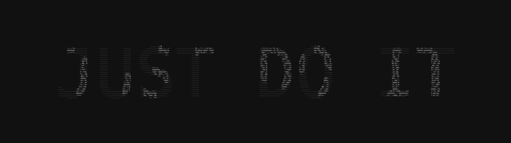 <b>G09 — Rd</b></td>
</tr>
<tr>
<td align="center"> <b>G09 — Sdf Neon</b></td>
<td align="center"> <b>G09 — Sdf</b></td>
</tr>
<tr>
<td align="center"> <b>G09 — Shape Ocean</b></td>
<td align="center"> <b>G09 — Shape</b></td>
</tr>
<tr>
<td align="center">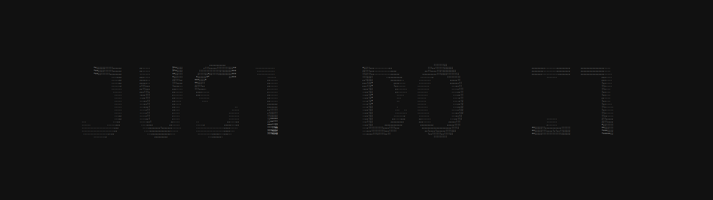 <b>G09 — Slime</b></td>
<td align="center"> <b>G09 — Truchet</b></td>
</tr>
<tr>
<td align="center"> <b>G09 — Turing Maze</b></td>
<td align="center">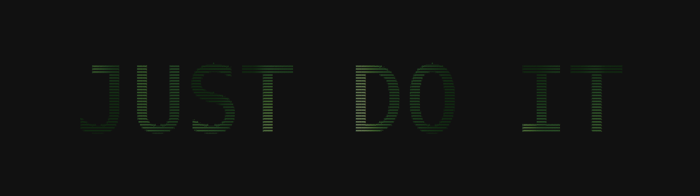 <b>G09 — Turing Spots</b></td>
</tr>
<tr>
<td align="center"> <b>G09 — Turing</b></td>
<td align="center"> <b>G09 — Voronoi Cells</b></td>
</tr>
<tr>
<td align="center">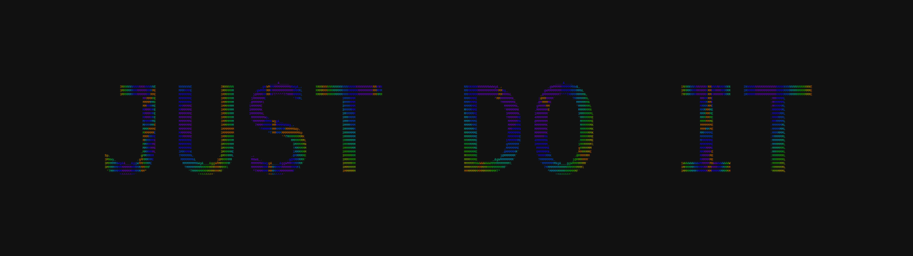 <b>G09 — Voronoi Coarse</b></td>
<td align="center">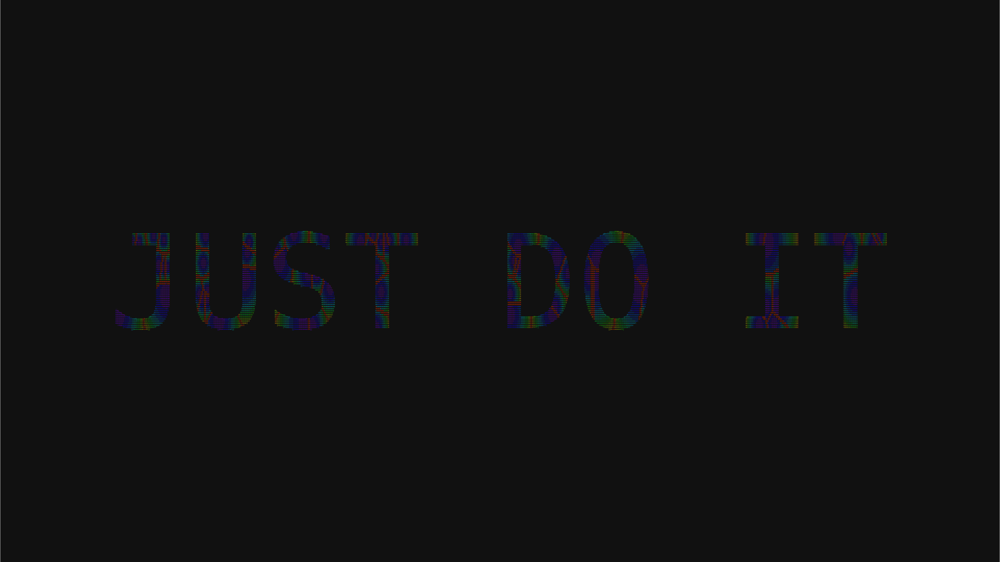 <b>G09 — Voronoi Cracked</b></td>
</tr>
<tr>
<td align="center"> <b>G09 — Voronoi Fine</b></td>
<td align="center">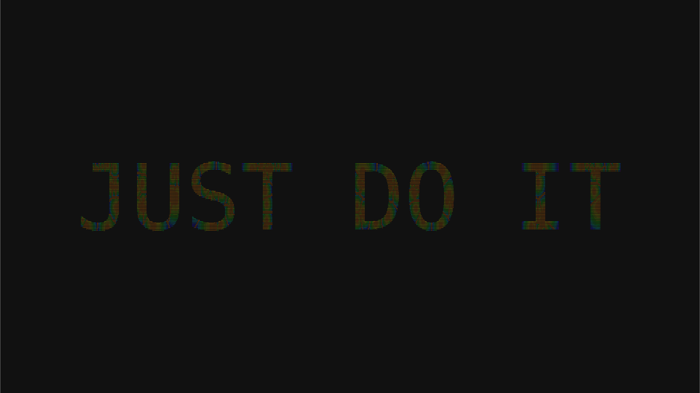 <b>G09 — Voronoi</b></td>
</tr>
<tr>
<td align="center"> <b>G09 — Wave Moire</b></td>
<td align="center">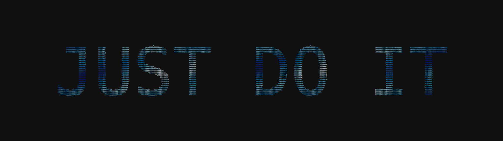 <b>G09 — Wave</b></td>
</tr>
</table>

*Last updated: 2026-04-24 — 46 techniques*
