# JustDoIt Gallery

Auto-generated visual showcase of rendering techniques.
Run `python scripts/demo.py --gallery` to regenerate.

> **4K gallery** — SVGs rendered at 3840×1080px canvas (50-row TTF, ~22px cells). Displayed at 780px width; open any SVG directly for native 4K density.

## Contents

- [Fonts (3)](#fonts)
- [Fill Effects (15)](#fill-effects)
- [Color Effects (6)](#color-effects)
- [Spatial & 3D (6)](#spatial--3d)

## Fonts

*Builtin, FIGlet, and TTF rasterized fonts*

<table>
<tr>
<td align="center">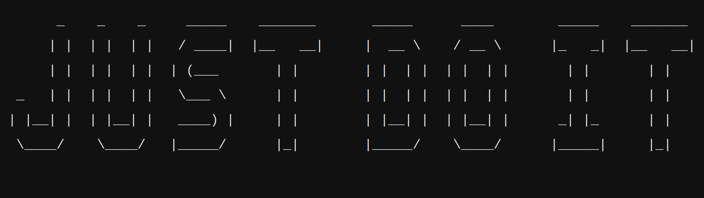 <b>G01 — Figlet Big</b></td>
<td align="center">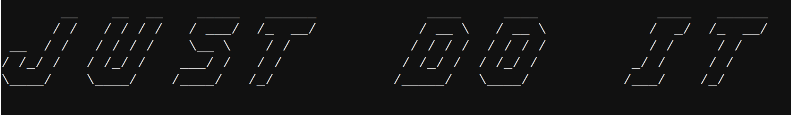 <b>G01 — Figlet Slant</b></td>
</tr>
<tr>
<td align="center">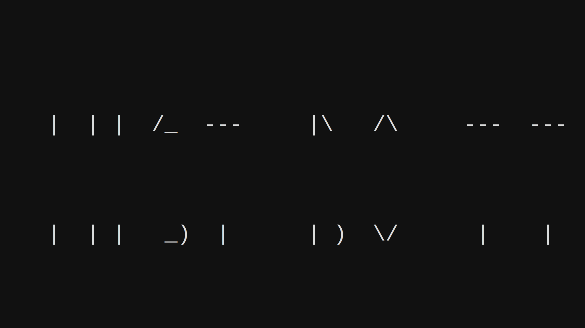 <b>G01 — Slim</b></td>
</tr>
</table>

## Fill Effects

*Character fill modes applied inside glyph masks*

<table>
<tr>
<td align="center">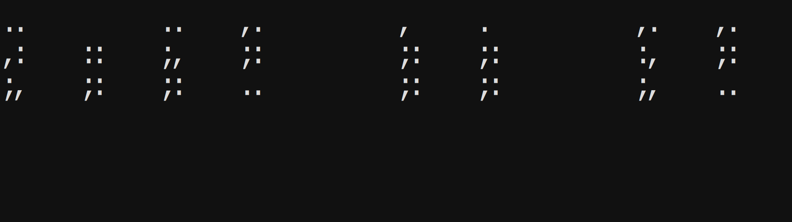 <b>F00 — Block Baseline</b></td>
<td align="center">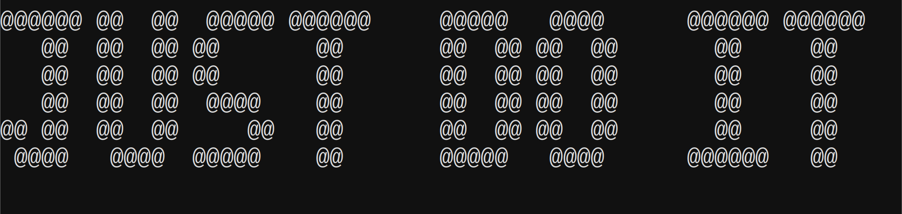 <b>F01 — Density Fill</b></td>
</tr>
<tr>
<td align="center">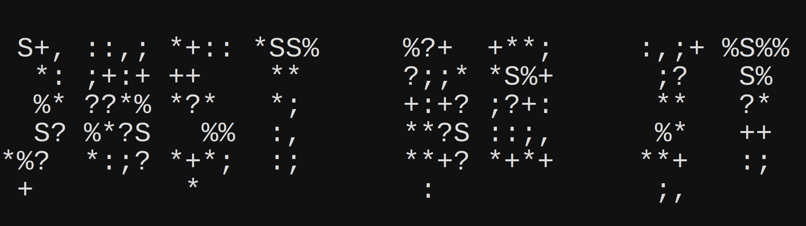 <b>F02 — Noise Fill</b></td>
<td align="center">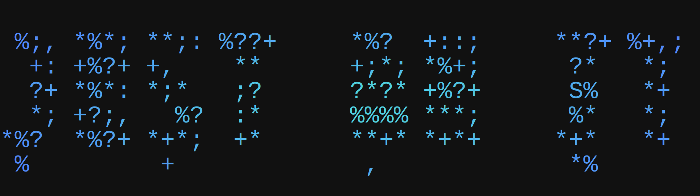 <b>F02 — Noise Radial</b></td>
</tr>
<tr>
<td align="center">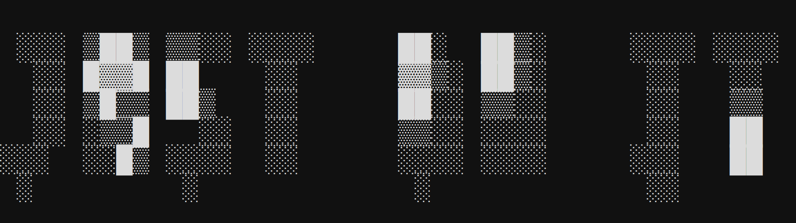 <b>F03 — Cells Fill</b></td>
<td align="center"> <b>F05 — Fractal Default</b></td>
</tr>
<tr>
<td align="center">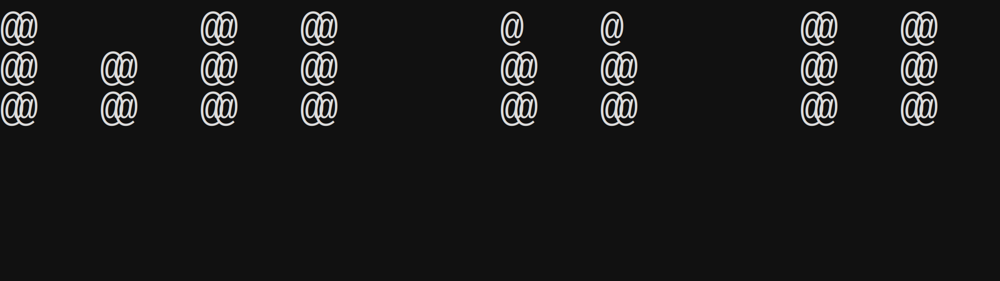 <b>F05 — Fractal Julia</b></td>
<td align="center">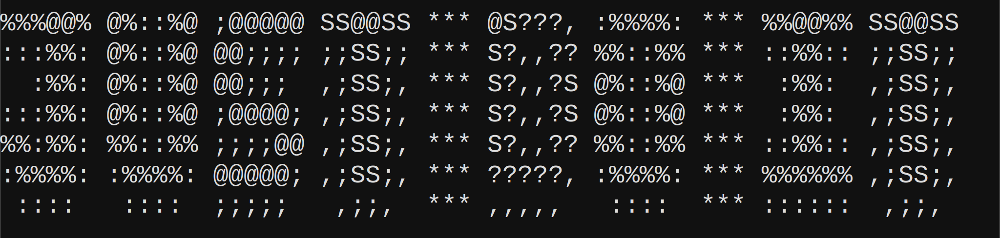 <b>F06 — Sdf Fill</b></td>
</tr>
<tr>
<td align="center">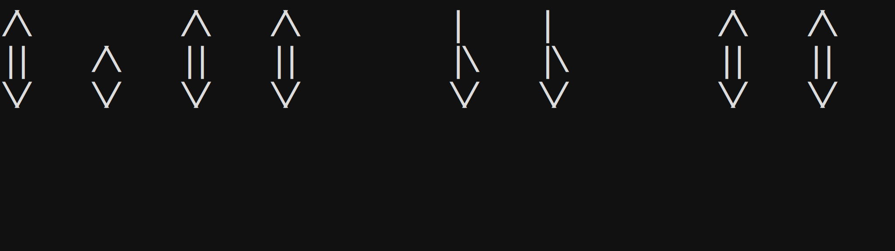 <b>F07 — Shape Fill</b></td>
<td align="center">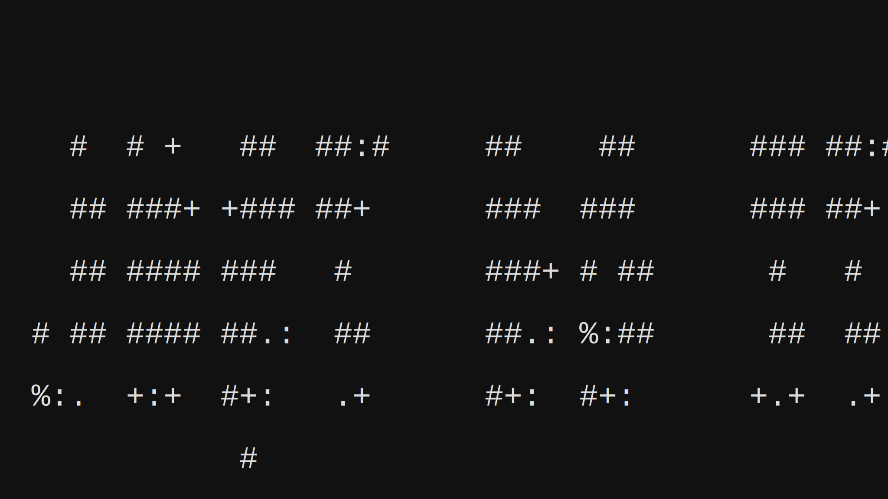 <b>F07 — Voronoi Coarse</b></td>
</tr>
<tr>
<td align="center"> <b>F07 — Voronoi Cracked</b></td>
<td align="center">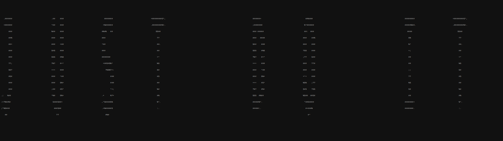 <b>F07 — Voronoi Default</b></td>
</tr>
<tr>
<td align="center">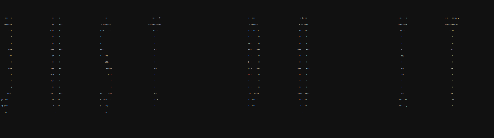 <b>F07 — Voronoi Fine</b></td>
<td align="center"> <b>F09 — Wave Default</b></td>
</tr>
<tr>
<td align="center">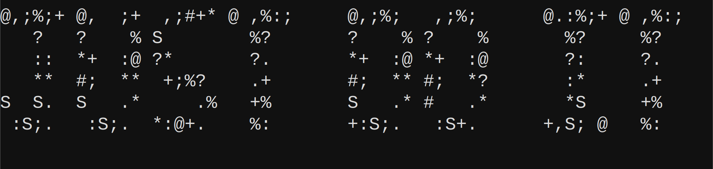 <b>F09 — Wave Moire</b></td>
</tr>
</table>

## Color Effects

*Gradients, palettes, and ANSI colorization*

<table>
<tr>
<td align="center">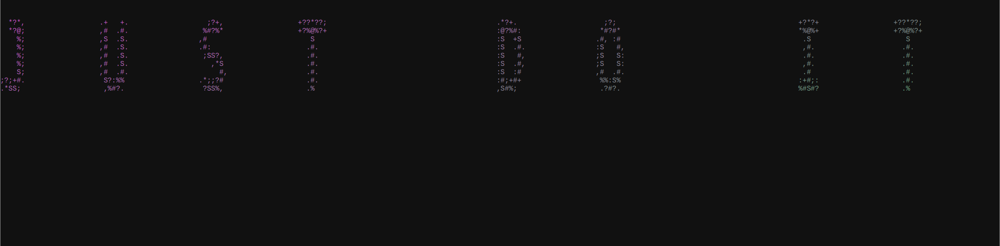 <b>C01 — Gradient Diag</b></td>
<td align="center">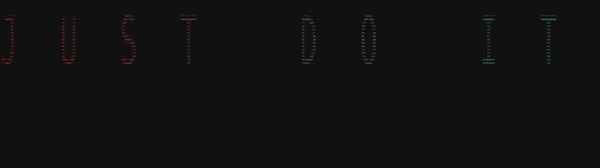 <b>C01 — Gradient Horiz</b></td>
</tr>
<tr>
<td align="center">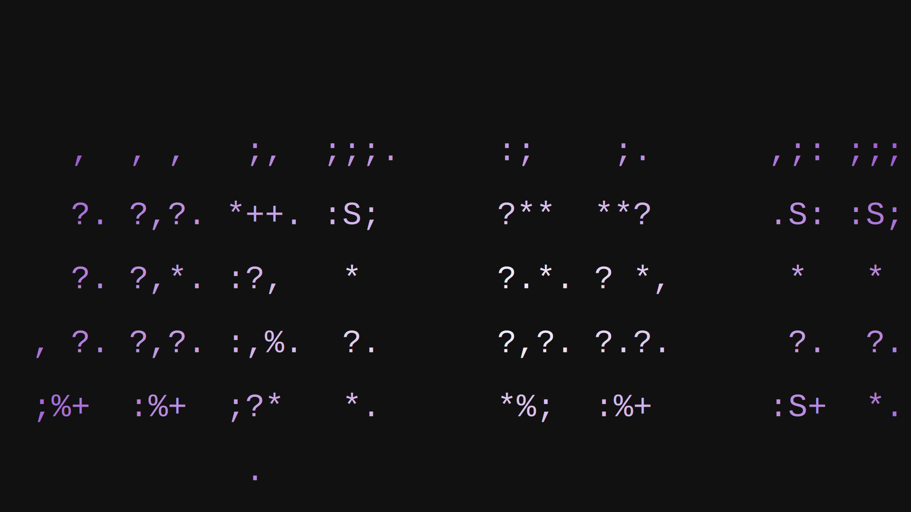 <b>C02 — Radial</b></td>
<td align="center">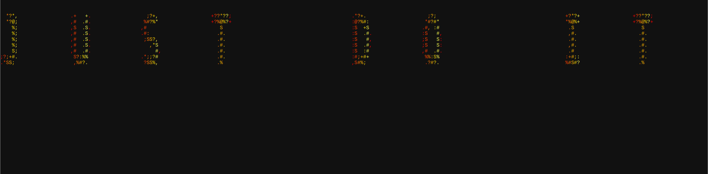 <b>C03 — Fire</b></td>
</tr>
<tr>
<td align="center">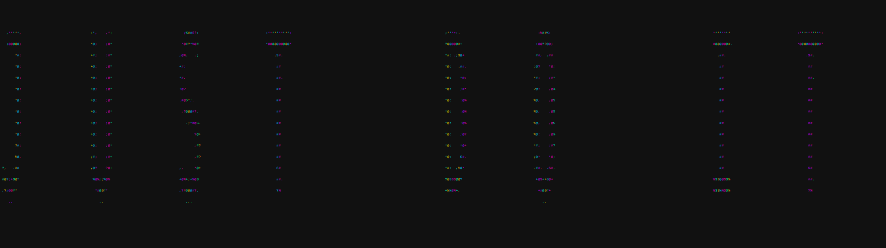 <b>C03 — Neon</b></td>
<td align="center">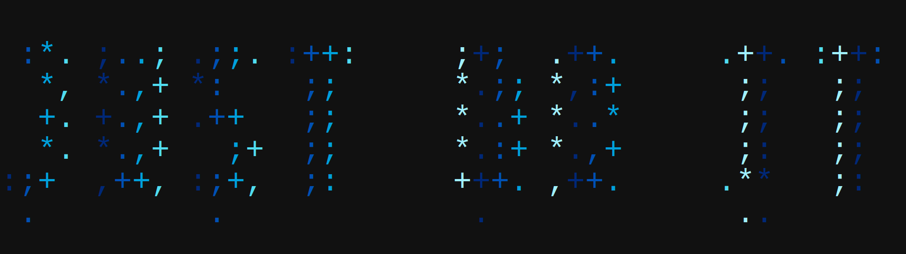 <b>C03 — Ocean</b></td>
</tr>
</table>

## Spatial & 3D

*Warps, perspective, shear, and isometric extrusion*

<table>
<tr>
<td align="center">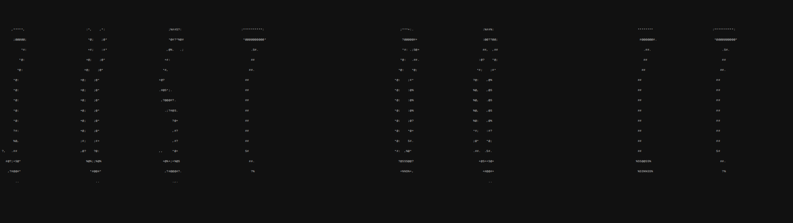 <b>S01 — Sine Warp</b></td>
<td align="center">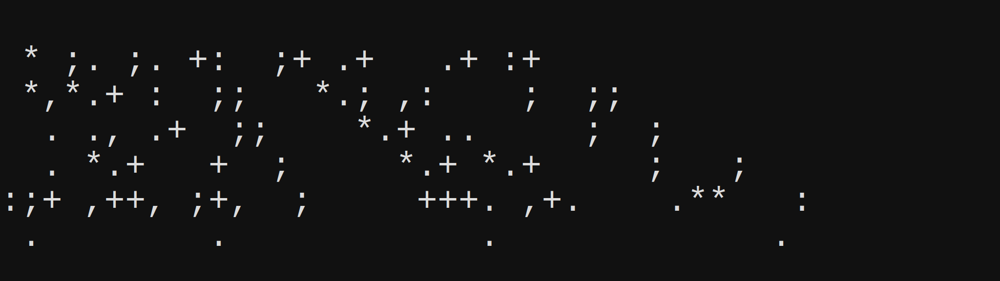 <b>S02 — Perspective Top</b></td>
</tr>
<tr>
<td align="center">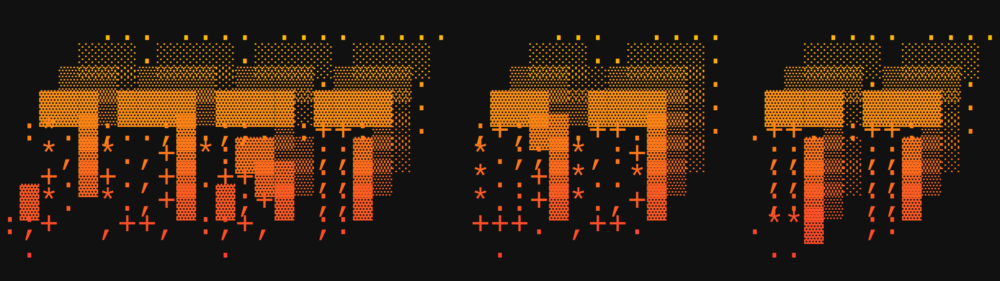 <b>S03 — Iso Gradient</b></td>
<td align="center">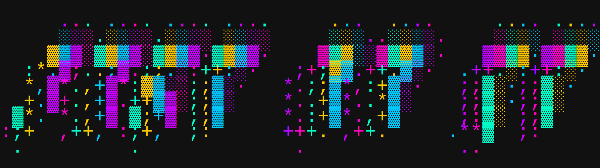 <b>S03 — Iso Neon Warp</b></td>
</tr>
<tr>
<td align="center">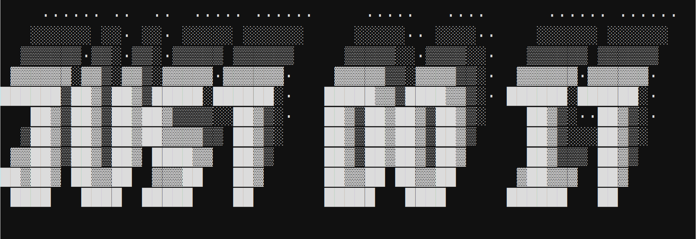 <b>S03 — Iso Right</b></td>
<td align="center">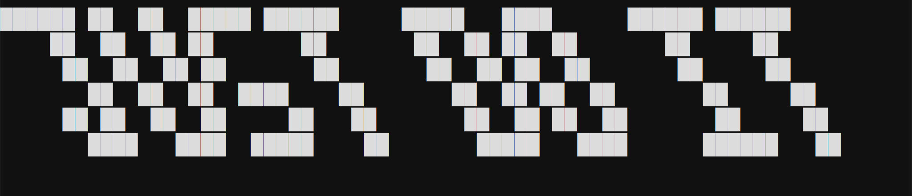 <b>S08 — Shear Right</b></td>
</tr>
</table>

*Last updated: 2026-04-24 — 40 techniques*
