# Font Gallery

> TTF font comparison — each entry shows how that font renders as ASCII art.
> Rendered at ~160 cols target width, wide-gallery style.
> **57 fonts rendered** (manual + Google Fonts batch).

## Curated Fonts

| Font | Preview |
|------|---------|
| **F-Bungee-Regular** |  |
| **F-DejaVuSans** |  |
| **F-DejaVuSans-Bold** |  |
| **F-DejaVuSansMono** |  |
| **F-DejaVuSansMono-Bold** |  |
| **F-DejaVuSerif** |  |
| **F-DejaVuSerif-Bold** |  |
| **F-Inconsolata-Regular** |  |
| **F-Oxanium-Bold** |  |
| **F-PressStart2P-Regular** |  |
| **F-RobotoMono-Bold** |  |
| **F-RobotoMono-Regular** |  |
| **F-ShareTechMono-Regular** |  |
| **F-SourceCodePro-Bold** |  |
| **F-SourceCodePro-Regular** |  |
| **F-SpaceMono-Bold** |  |
| **F-SpaceMono-Regular** |  |

## Google Fonts Batch

| Font | Preview |
|------|---------|
| **G-Aclonica-Regular** |  |
| **G-Arimo-Italic[wght]** | ![G-Arimo-Italic[wght]](G-Arimo-Italic[wght].svg) |
| **G-Arimo[wght]** | ![G-Arimo[wght]](G-Arimo[wght].svg) |
| **G-Calligraffitti-Regular** |  |
| **G-CherryCreamSoda-Regular** |  |
| **G-Chewy-Regular** |  |
| **G-ComingSoon-Regular** |  |
| **G-Cousine-Bold** |  |
| **G-Cousine-BoldItalic** |  |
| **G-Cousine-Italic** |  |
| **G-Cousine-Regular** |  |
| **G-CraftyGirls-Regular** |  |
| **G-CreepsterCaps-Regular** |  |
| **G-Crushed-Regular** |  |
| **G-FontdinerSwanky-Regular** |  |
| **G-HomemadeApple-Regular** |  |
| **G-IrishGrover-Regular** |  |
| **JustAnotherHand-Regular** | 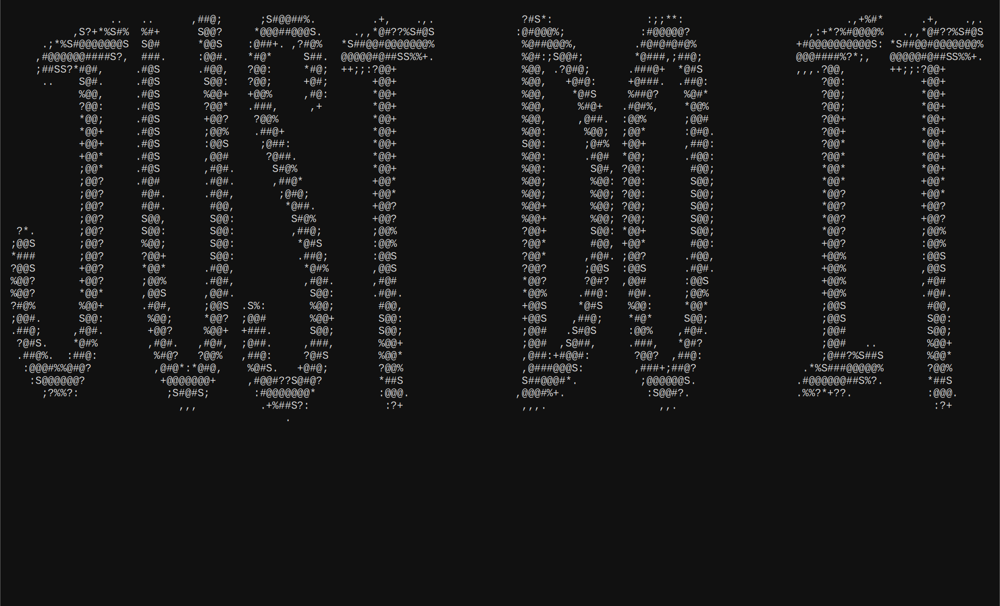 |
| **Kosugi-Regular** |  |
| **KosugiMaru-Regular** | 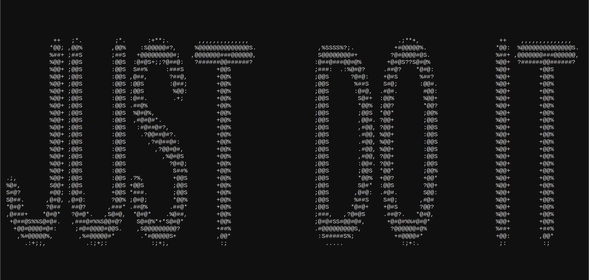 |
| **Kranky-Regular** | 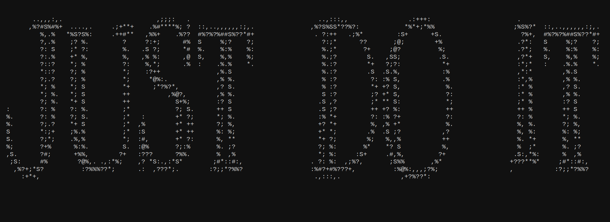 |
| **LuckiestGuy-Regular** | 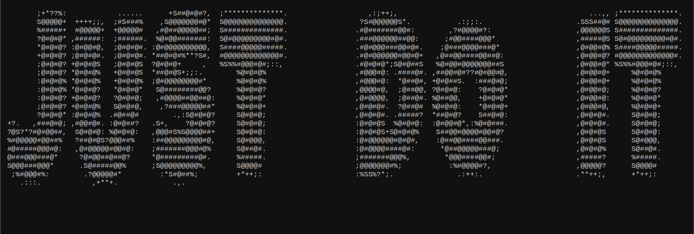 |
| **MaidenOrange-Regular** | 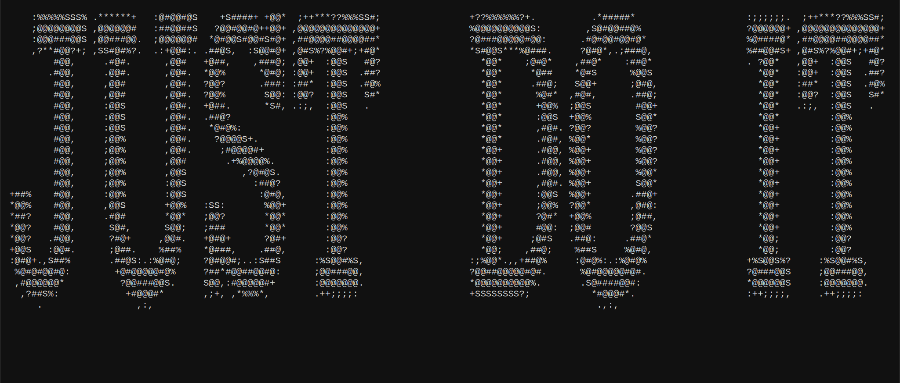 |
| **Montez-Regular** | 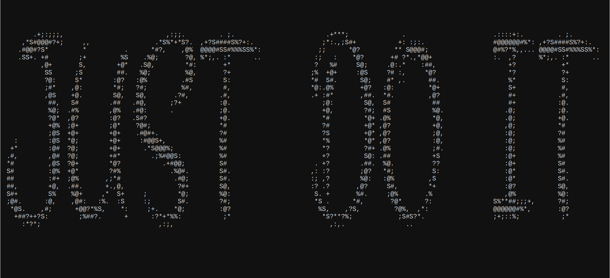 |
| **MountainsofChristmas-Bold** |  |
| **MountainsofChristmas-Regular** | 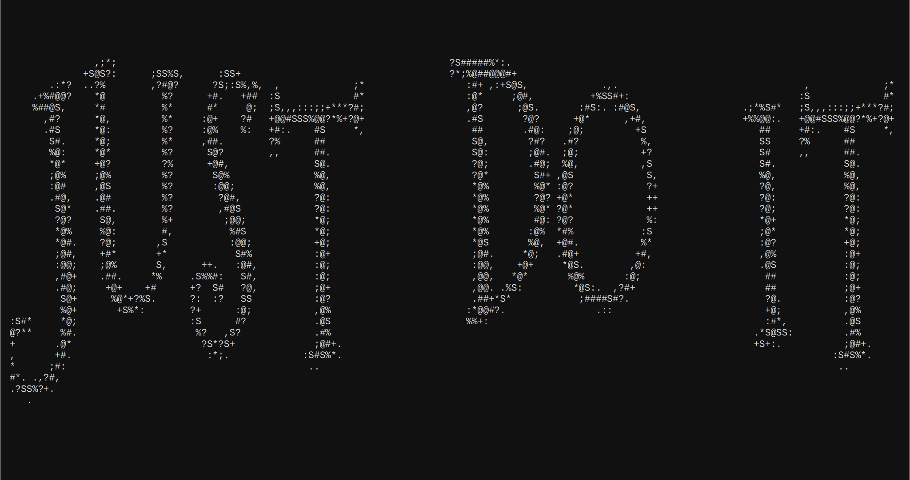 |
| **OpenSansHebrew-Bold** | 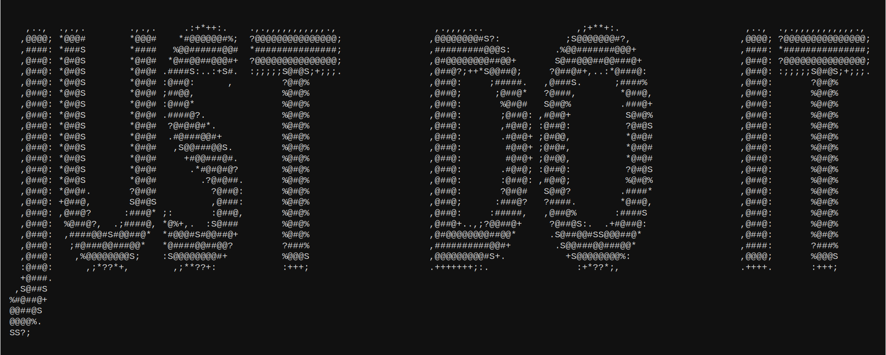 |
| **OpenSansHebrew-BoldItalic** | 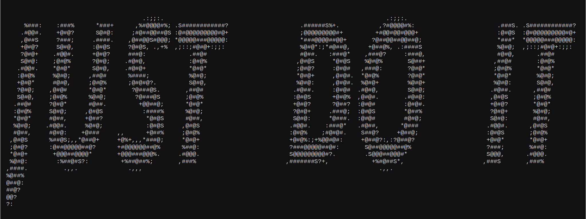 |
| **OpenSansHebrew-ExtraBold** | 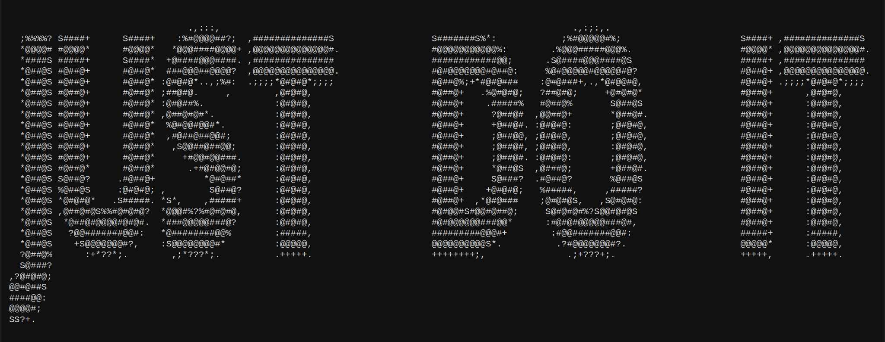 |
| **OpenSansHebrew-ExtraBoldItalic** | 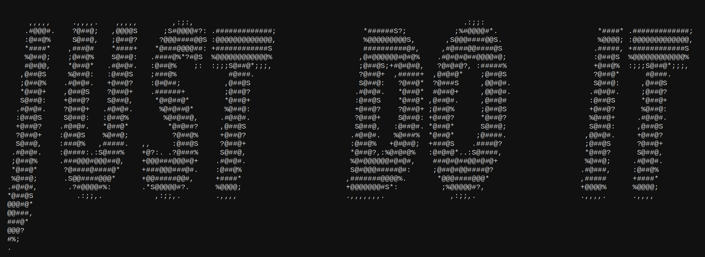 |
| **OpenSansHebrew-Italic** |  |
| **OpenSansHebrew-Light** | 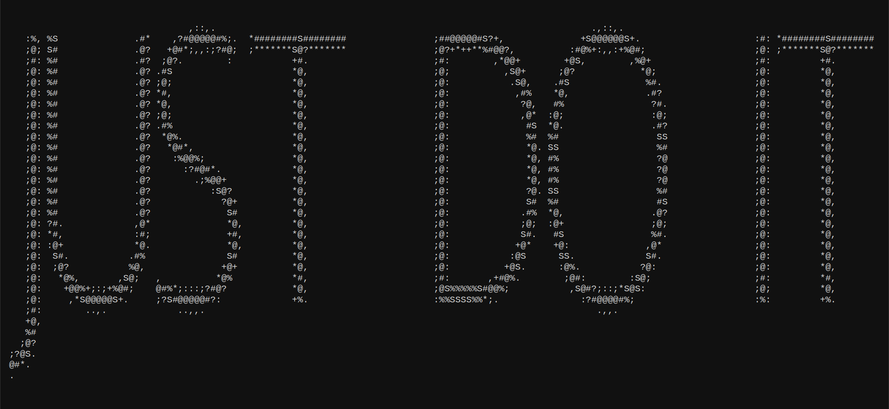 |
| **OpenSansHebrew-LightItalic** | 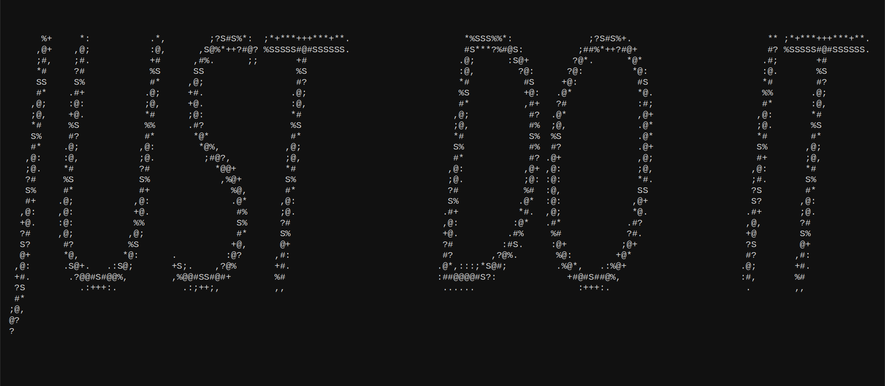 |
| **OpenSansHebrew-Regular** | 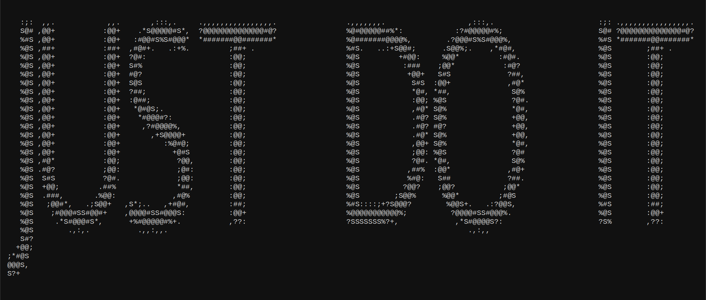 |
| **G-jsMath-cmbx10** |  |
| **G-jsMath-cmex10** |  |
| **G-jsMath-cmmi10** |  |
| **jsMath-cmr10** | 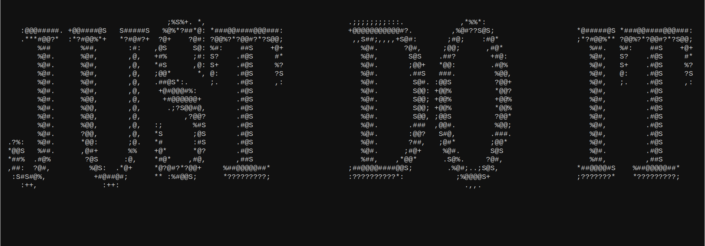 |
| **jsMath-cmsy10** | 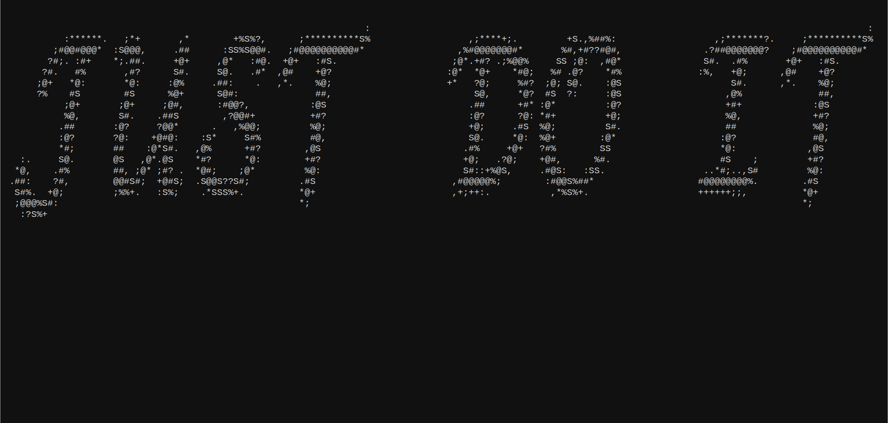 |
| **jsMath-cmti10** | 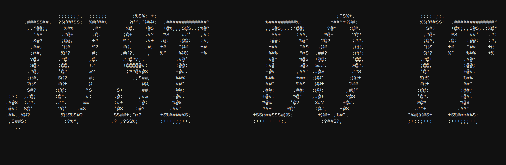 |
