# JustDoIt Gallery

Auto-generated visual showcase of rendering techniques.
Run `python scripts/demo.py --gallery` to regenerate.

## Contents

- [Fonts (4)](#fonts)
- [Fill Effects (15)](#fill-effects)
- [Color Effects (8)](#color-effects)
- [Spatial & 3D (8)](#spatial--3d)
- [Daily Techniques (25)](#daily-techniques)

## Fonts

*Builtin, FIGlet, and TTF rasterized fonts*

<table>
<tr>
<td align="center">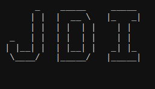 <b>G01 — Figlet Big</b></td>
<td align="center">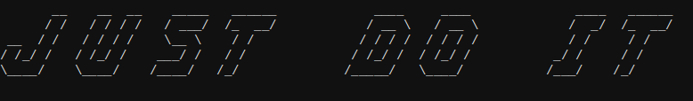 <b>G01 — Figlet Slant</b></td>
</tr>
<tr>
<td align="center">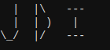 <b>G01 — Slim</b></td>
<td align="center">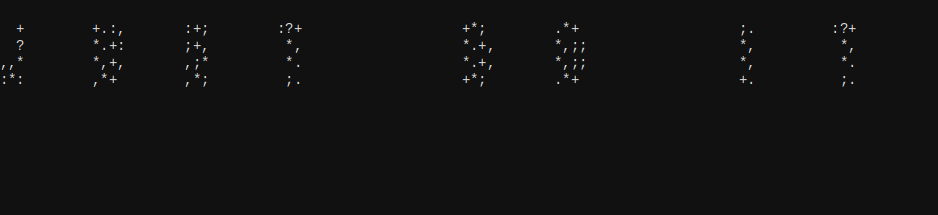 <b>G02 — Ttf</b></td>
</tr>
</table>

## Fill Effects

*Character fill modes applied inside glyph masks*

<table>
<tr>
<td align="center">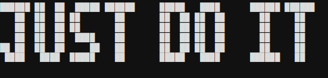 <b>F00 — Block Baseline</b></td>
<td align="center">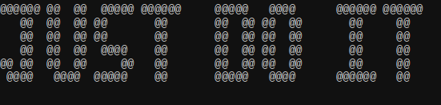 <b>F01 — Density Fill</b></td>
</tr>
<tr>
<td align="center">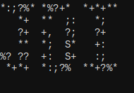 <b>F02 — Noise Fill</b></td>
<td align="center">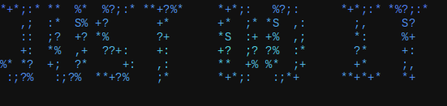 <b>F02 — Noise Radial</b></td>
</tr>
<tr>
<td align="center">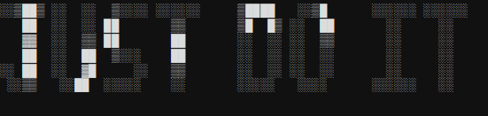 <b>F03 — Cells Fill</b></td>
<td align="center"> <b>F05 — Fractal Default</b></td>
</tr>
<tr>
<td align="center">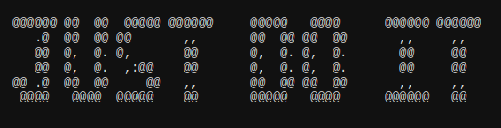 <b>F05 — Fractal Julia</b></td>
<td align="center">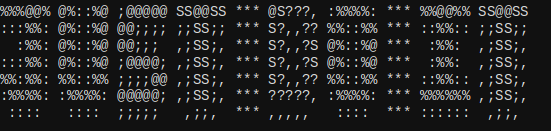 <b>F06 — Sdf Fill</b></td>
</tr>
<tr>
<td align="center">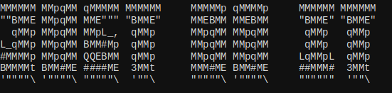 <b>F07 — Shape Fill</b></td>
<td align="center">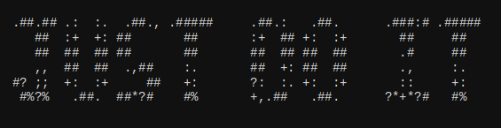 <b>F07 — Voronoi Coarse</b></td>
</tr>
<tr>
<td align="center">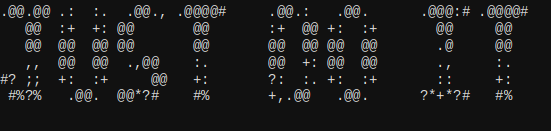 <b>F07 — Voronoi Cracked</b></td>
<td align="center">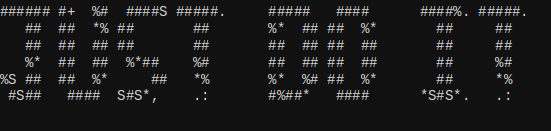 <b>F07 — Voronoi Default</b></td>
</tr>
<tr>
<td align="center">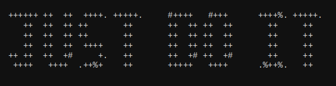 <b>F07 — Voronoi Fine</b></td>
<td align="center">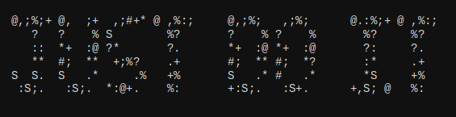 <b>F09 — Wave Default</b></td>
</tr>
<tr>
<td align="center"> <b>F09 — Wave Moire</b></td>
</tr>
</table>

## Color Effects

*Gradients, palettes, and ANSI colorization*

<table>
<tr>
<td align="center">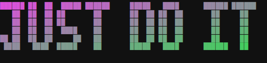 <b>C01 — Gradient Diag</b></td>
<td align="center">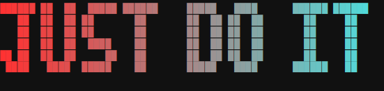 <b>C01 — Gradient Horiz</b></td>
</tr>
<tr>
<td align="center">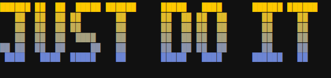 <b>C01 — Gradient Vert</b></td>
<td align="center">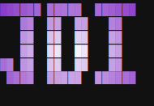 <b>C02 — Radial</b></td>
</tr>
<tr>
<td align="center">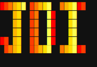 <b>C03 — Fire</b></td>
<td align="center">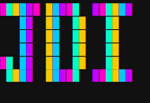 <b>C03 — Neon</b></td>
</tr>
<tr>
<td align="center">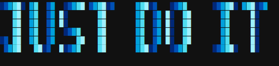 <b>C03 — Ocean</b></td>
<td align="center">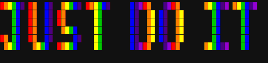 <b>C03 — Rainbow</b></td>
</tr>
</table>

## Spatial & 3D

*Warps, perspective, shear, and isometric extrusion*

<table>
<tr>
<td align="center">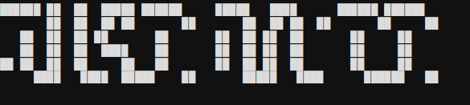 <b>S01 — Sine Warp</b></td>
<td align="center">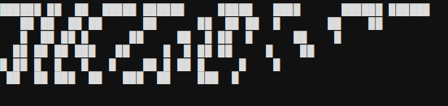 <b>S02 — Perspective Bottom</b></td>
</tr>
<tr>
<td align="center">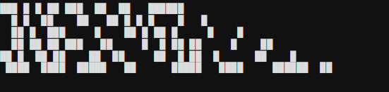 <b>S02 — Perspective Top</b></td>
<td align="center">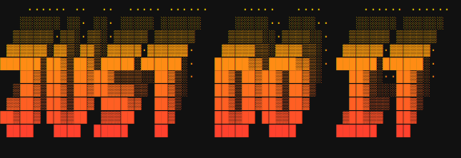 <b>S03 — Iso Gradient</b></td>
</tr>
<tr>
<td align="center">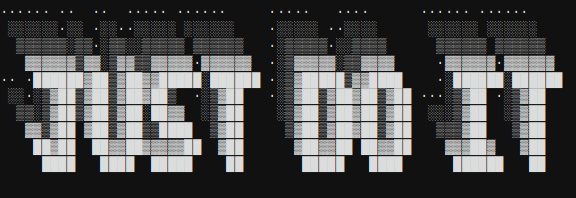 <b>S03 — Iso Left</b></td>
<td align="center">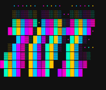 <b>S03 — Iso Neon Warp</b></td>
</tr>
<tr>
<td align="center">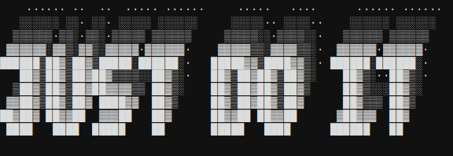 <b>S03 — Iso Right</b></td>
<td align="center">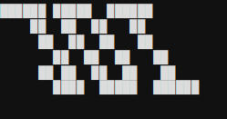 <b>S08 — Shear Right</b></td>
</tr>
</table>

## Daily Techniques

*New technique added each day by the daily agent — newest first.*
*▶ Animated entries show the APNG from the animation gallery.*

<table>
<tr>
<td align="center"> <b>2026-04-26 · X_Iso_Neon</b></td>
<td align="center"> <b>2026-04-24 · X_Living_Color</b></td>
</tr>
<tr>
<td align="center"> <b>2026-04-23 · A06</b></td>
<td align="center"> <b>2026-04-22 · X_Plasma_Noise_Warp</b></td>
</tr>
<tr>
<td align="center"> <b>2026-04-21 · X_Noise_Warp</b></td>
<td align="center"> <b>2026-04-20 · X_Flame_Iso_Bloom</b></td>
</tr>
<tr>
<td align="center"> <b>2026-04-19 · X_Turing_Warp</b></td>
<td align="center"> <b>2026-04-18 · X_Fractal_Classic</b></td>
</tr>
<tr>
<td align="center"> <b>2026-04-17 · X_Plasma_Warp</b></td>
<td align="center"> <b>2026-04-17 · A08D</b></td>
</tr>
<tr>
<td align="center"> <b>2026-04-15 · X_Turing_Bio</b></td>
<td align="center"> <b>2026-04-15 · A_N09A</b></td>
</tr>
<tr>
<td align="center"> <b>2026-04-14 · A_Iso1</b></td>
<td align="center"> <b>2026-04-11 · X_Plasma_Bloom</b></td>
</tr>
<tr>
<td align="center"> <b>2026-04-10 · A_Bloom1</b></td>
<td align="center"> <b>2026-04-09 · X_Flame_Bloom</b></td>
</tr>
<tr>
<td align="center"> <b>2026-04-09 · A08C</b></td>
<td align="center"> <b>2026-04-08 · X_Neon_Bloom</b></td>
</tr>
<tr>
<td align="center"> <b>2026-04-06 · A_Vor1</b></td>
<td align="center"> <b>2026-04-06 · A10C</b></td>
</tr>
<tr>
<td align="center"> <b>2026-04-04 · A08</b></td>
<td align="center"> <b>2026-04-03 · A10</b></td>
</tr>
<tr>
<td align="center">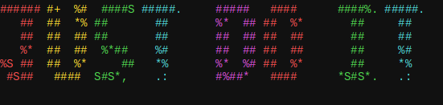 <b>2026-04-02 · F07</b></td>
<td align="center">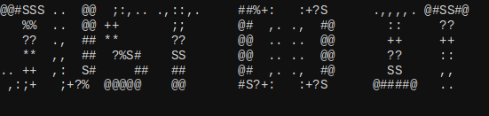 <b>2026-03-30 · N09</b></td>
</tr>
<tr>
<td align="center">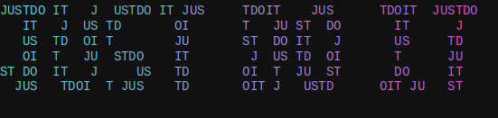 <b>2026-03-29 · N01</b></td>
</tr>
</table>

*Last updated: 2026-04-26 — 70 techniques*
